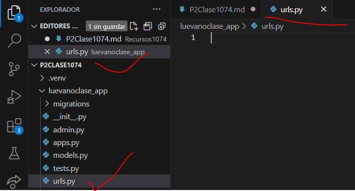
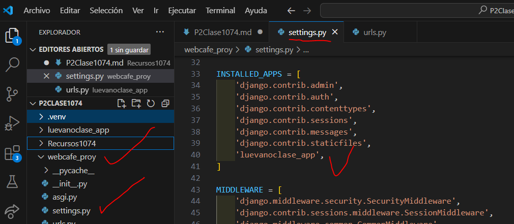
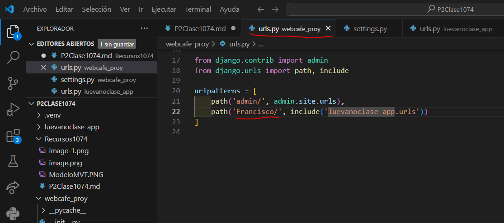
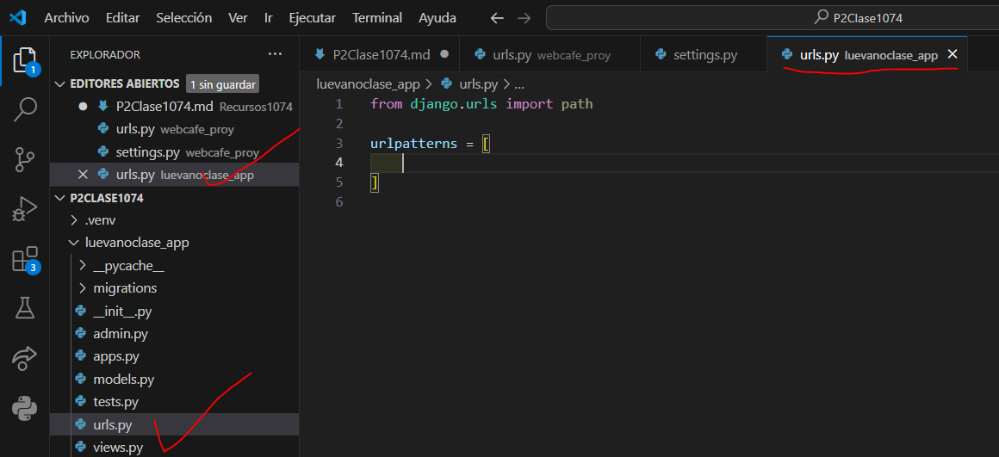
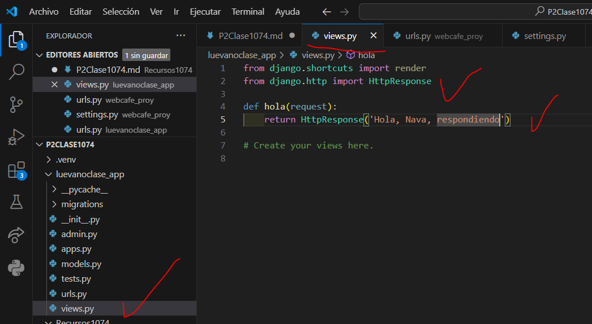

- Crear aplicación luevanoclase_app
- Comando --> python manage.py startapp luevanoclase_app
- Creamos el archivo urls.py en luevanoclase_app
- 
- En setting.py de P2Clase1074
- 
- En urls.py de P2Clase1074
- 
- En urls.py en luevanoclase_app
- 
- En views.py en luevanoclase_app
- 
- En urls.py luevanoclase_app
- 